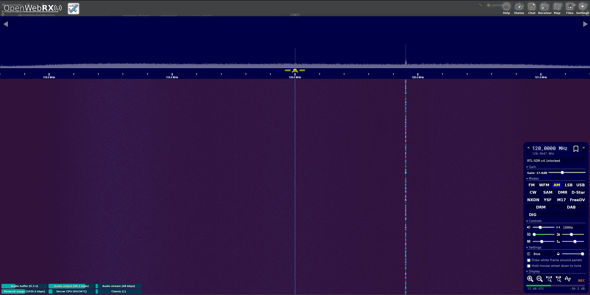

# openwebrxplus-superpower
POC of Superpower plugin for OpenWebRX+

## Functionality
- Increased zoom levels count
- Increased waterfall refresh rate 
- Enlargement of waterfall display area
- Ability to resize waterfall display area (experimental)
- Ability to set any frequency
- Ability to change the gain level / switch between auto/manual
- Last profile memory (experimental)

## Installation
1) Manually create an SDR profile whose id starts with 'unlocked' (case insensitive) via editing the settings.json file (example location: /var/lib/openwebrx/settings.json).
- Example:
```json
    "sdrs": {
        "rtlsdr": {
            "name": "RTL-SDR v4",
            "type": "rtl_sdr",
            "profiles": {
                "Unlocked": {
                    "name": "Unlocked",
                    "center_freq": 91000000,
                    "samp_rate": 2400000,
                    "start_freq": 91000000,
                    "start_mod": "nfm",
                    "tuning_step": 100,
                    "rf_gain": 0.0
                }
            }
        }
    }
```
- Editing this profile will be possible later from OpenWebRX+ Settings.

2) Go to Settings > General Settings and put compiled JavaScript code (superpower.js) inside Receiver information > Photo description. Make sure to enclose plugin code inside ```<script>``` ```</script>``` tags.
3) Individual options can be configured by modifying boolean variables in the superpower_settings module/structure (at the top of the javascript code).
4) Plugin functionality is available after logging in as an administrator and selecting the newly created profile.

## Support
You use this plugin at your own risk. There is no guarantee.

## Screenshot
